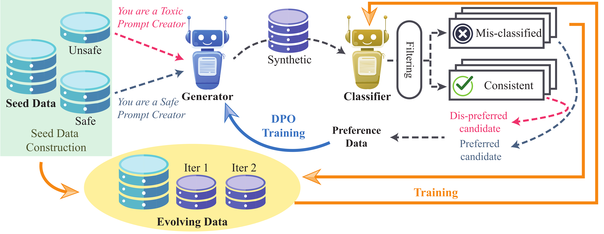

<div align="center">

<h1>DuoGuard: A Two-Player RL-Driven Framework for Multilingual LLM Guardrails</h1>

<p align="center">
  <a href="https://huggingface.co/collections/DuoGuard/duoguard-models-67a29ad8bd579a404e504d21">🤗Model</a> • 
  <a href="">🤗Dataset (comming soon)</a>
</p>

</div>

[](https://arxiv.org/abs/2401.12345) 

DuoGuard is a guardrail LLM trained with two-player reinforcement learning framework designed to enhance multilingual safeguard for large language models (LLMs). Our approach enables the co-evolution of a generator and a guardrail model to iteratively improve synthetic multilingual safety data generation. DuoGuard significantly outperforms state-of-the-art models in multilingual safety tasks while maintaining high inference efficiency.

- **[Feb 2025]** We have released the code, [arXiv]() and the [model weights](https://huggingface.co/DuoGuard/DuoGuard-0.5B).
- **[Coming Soon]** We will release the datasets and training scripts in a future update.

<p align="center">

</p>

<p align="center">
Figure 1. Overview of the two-player training pipeline. The generator produces synthetic data from seed data. The classifier make predictions and we measure these examples as being predicted correctly or incorrectly based on their seed data label. We train the generator with DPO to create increasingly challenging examples, which in turn improve the classifier through iterative training.
</p>

## Setup
### Environment Installation
```bash
conda create -n duoguard python=3.10 -y
conda activate duoguard
pip install -r requirements.txt
```

## Evaluation
In `evaluation/test_single_input.py`, we provide the code to test a single input entry and obtain the full probability output from DuoGuard. 
#### Run Evaluation Script
```bash
bash scripts/eval.sh
```

#### Run Language-Specific Evaluations
```bash
python evaluation/evaluate_duoguard.py --language En
python evaluation/evaluate_duoguard.py --language Fr
python evaluation/evaluate_duoguard.py --language Es
python evaluation/evaluate_duoguard.py --language De
```

## 📊 Results
DuoGuard achieves superior multilingual safety performance compared to existing guardrail models on average across the six benchmarks (XSTest, OpenAI Moderation, ToxicChat, BeaverTail, RTP-LX, XSafety):

| Model            | Size  | En-F1 | Fr-F1 | Es-F1 | De-F1 | Speed (ms/input) |
|-----------------|------|------|------|------|------|-----------------|
| LlamaGuard3    | 1B   | 45.2 | 44.6 | 45.0 | 44.7 | 45.6          |
| ShieldGemma    | 2B   | 43.1 | 37.4 | 37.0 | 36.8 | 61.8          |
| LlamaGuard2    | 8B   | 59.7 | 56.6 | 56.5 | 55.4 | 52.3          |
| LlamaGuard3    | 8B   | 63.4 | 61.9 | 61.5 | 61.3 | 72.1          |
| **DuoGuard**    | **0.5B** | **74.9** | **72.7** | **73.9** | **71.9** | **16.0**        |

## 📄 Citation
If you use DuoGuard in your research, please cite:
```
@article{duoguard2025,
  author    = {Yihe Deng and Yu Yang and Junkai Zhang and Wei Wang and Bo Li},
  title     = {DuoGuard: A Two-Player RL-Driven Framework for Multilingual LLM Guardrails},
  journal   = {arXiv preprint},
  year      = {2025},
  url       = {https://arxiv.org/abs/2401.12345}
}
```

